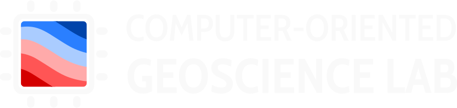
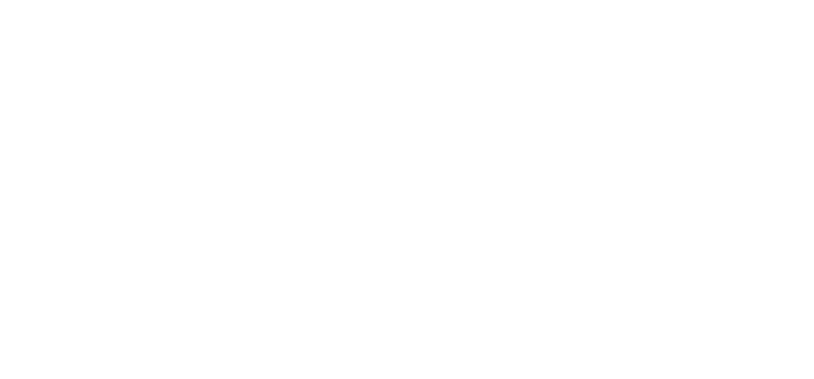

<!--
-------------------------------------------------------------------------------
This file defines the contents of each slide.
The reveal.js configuration can be found in index.html
-------------------------------------------------------------------------------
-->

<!-- .slide: class="slide-title" data-background-image="assets/title-slide.jpg" data-background-color="#000000" data-background-size="contain" -->

<!-- Place the content at the bottom of the slide -->

<h1 id="talk-title">
  Modeling of magnetic field
  observations
   
  from continental  to microscopic scale
</h1>

  <a href="https://www.leouieda.com" id="talk-speaker">Leonardo Uieda</a>

<!-- Place location and date side-by-side with affiliation logos -->

<i class="fa fa-calendar-alt" style="margin: 0 10px 0 0"></i>
29 de setembro 2025

Concurso de Livre Docência | IAG/USP

<i class="fa fa-book" style="margin: 0 10px 0 0"></i>
Tese: [doi.org/10.6084/m9.figshare.28791908](https://doi.org/10.6084/m9.figshare.28791908)

<!-- Permission to reuse and CC-BY license logo -->
<i class="fa fa-camera" style="margin: 0 10px 0 0"></i>
Feel free to screenshot/share/reuse this presentation

<a href="https://creativecommons.org/licenses/by/4.0/"><i class="fab fa-creative-commons"></i><i class="fab fa-creative-commons-by" style="margin: 0 10px 0 2px"></i>CC-BY 4.0 License</a>

<!-- Add logos here. Need these wrappers to align them to the bottom right -->

  
  
  

===============================================================================

<!-- .slide: class="slide-transition" -->

# Introdução

===============================================================================

<!-- .slide: data-background-image="assets/wdmam.jpg" data-background-size="contain" data-background-color="#000000" -->

World Digital Magnetic Anomaly Map ([wdmam.org](https://wdmam.org/)).

===============================================================================

1. <!-- .element: class="fragment" -->Processamento
1. <!-- .element: class="fragment" -->Continuação
1. <!-- .element: class="fragment" -->Interpolação
1. <!-- .element: class="fragment" -->Combinação
1. <!-- .element: class="fragment" -->Inversão

===============================================================================

<!-- .slide: data-background-image="assets/qdm-basalt.svg" data-background-size="contain" -->

Imagem ótica (esquerda) e component vertical do campo magnético de uma amostra
 
de basalto medidos por um QDM
([Souza-Junior et a., 2025](https://doi.org/10.31223/X5N42F))

===============================================================================

1. <!-- .element: class="fragment" -->Rotação de $B_{111}$ para $B_z$
1. <!-- .element: class="fragment" -->Detecção de anomalias
1. <!-- .element: class="fragment" -->Determinação de posição
1. <!-- .element: class="fragment" -->Determinação de momento

===============================================================================

# Esta tese

1. <!-- .element: class="fragment" -->
   Continuação e **interpolação** de dados aeromagnéticos
1. <!-- .element: class="fragment" -->
   Detecção de anomalias e **inversão** de dados de **microscopia**
1. <!-- .element: class="fragment" -->
   Determinação de **posição e forma** de fontes magnéticas

===============================================================================

# Trabalho de pessoas maravilhosas

Santiago Soler

PhD Un. Nacional San Juan
 
Posdoc UBC

India Uppal

PhD U. of Liverpool

Gelson Souza-Junior

PhD IAG/USP

===============================================================================

<!-- .slide: class="slide-transition" -->

# Parte 1   Fontes equivalentes

===============================================================================

# Artigos

Soler, S. R. and Uieda, L. (2021). **Gradient-boosted equivalent sources**.
Geophysical Journal International.
doi:[10.1093/gji/ggab297](https://doi.org/10.1093/gji/ggab297).

Uppal, I., Uieda, L., Oliveira Jr., V. C. and Holme, R. (2025).
**Transforming Total Field Anomaly into Anomalous Magnetic Field: Using
Dual-Layer Gradient-Boosted Equivalent Sources.**
EarthArXiv.
doi:[10.31223/X58B1Q](https://doi.org/10.31223/X58B1Q).
<!-- .element: class="fragment fade-in-then-semi-out" -->

Uppal, I., Uieda, L., Oliveira Jr., V. C., Holme, R. (2025). **Dual-Layer
Gradient-Boosted Equivalent Sources for Magnetic Data.** Geophysical Journal
International. doi:[10.1093/gji/ggaf359](https://doi.org/10.1093/gji/ggaf359).
<!-- .element: class="fragment" -->

===============================================================================

===============================================================================

<!-- .slide: class="slide-transition" -->

# Parte 2   Microscopia magnética

===============================================================================

# Artigos

Souza-Junior, G. F., Uieda, L., Trindade, R. I. F., Carmo, J. and Fu, R. R.
(2024). **Full vector inversion of magnetic microscopy images using Euler
deconvolution as prior information.** Geochemistry, Geophysics, Geosystems.
doi:[10.1029/2023GC011082](https://doi.org/10.1029/2023GC011082).

Souza-Junior, G. F., Uieda, L., Trindade, R. I. F., Fu, R. R., Bellon, U. D.
and Castro, Y. M. (2025). **Robust directional analysis of magnetic microscopy
images using non-linear inversion and iterative Euler deconvolution.**
EarthArXiv. doi:[10.31223/X5N42F](https://doi.org/10.31223/X5N42F).
("major revisions" na JGR: Solid Earth)
<!-- .element: class="fragment" -->

===============================================================================

<!-- .slide: class="slide-transition" -->

# Parte 3   Inversão de Euler

===============================================================================

# Artigo

Uieda, L., Souza-Junior, G. F., Uppal, I. and Oliveira Jr., V. C. (2025).
**Euler inversion: Locating sources of potential-field data through inversion
of Euler's homogeneity equation.** Geophysical Journal International.
doi:[10.1093/gji/ggaf114](https://doi.org/10.1093/gji/ggaf114).

===============================================================================

<!-- .slide: class="slide-transition" -->

===============================================================================

<!-- .slide: data-background-image="assets/compgeolab.jpg" data-background-size="contain" data-background-position="bottom" -->

**Obrigado aos estudantes e colaboradores do CompGeoLab**

India, Gelson, Santiago, Arthur, Yago, Eros, Ellen, Gabriel, Felipe, Paulo,
Gabriella, Jefferson

Vanderlei Oliveira Jr., Ricardo Trindade, Richard Holme, Roger Fu,
  Ualisson Bellon, Janine Carmo

===============================================================================

<!-- .slide: class="slide-contact" data-background-image="assets/contact-slide.svg" data-background-size="contain" data-background-color="#000000" -->

<i class="fas fa-comments"></i>
 
Contato e mais informações sobre o autor:
 
<a href="https://www.leouieda.com">www.leouieda.com</a>

<i class="fab fa-github"></i>
 
Código desta apresentação e o texto da tese:
 
[github.com/leouieda/livre-docencia](https://github.com/leouieda/livre-docencia)

<i class="fab fa-creative-commons"></i><i class="fab fa-creative-commons-by"></i>
 
Unless otherwise noted,
the contents of this presentation are
licensed under the
 
[Creative Commons Attribution 4.0 International License](https://creativecommons.org/licenses/by/4.0/).

Imagem de fundo é uma cena do Landsat 9 próximo à foz do Rio Amazonas.
Fonte: [github.com/leouieda/landsat-wallpapers](https://github.com/leouieda/landsat-wallpapers)

