<!--
-------------------------------------------------------------------------------
This file defines the contents of each slide.
The reveal.js configuration can be found in index.html
-------------------------------------------------------------------------------
-->

<!-- .slide: class="slide-title" data-background-image="assets/title-slide.jpg" data-background-color="#000000" data-background-size="contain" -->

<!-- Place the content at the bottom of the slide -->

<h1 id="talk-title">
  Modeling of magnetic field
  observations
   
  from continental  to microscopic scale
</h1>

  <a href="https://www.leouieda.com" id="talk-speaker">Leonardo Uieda</a>

<!-- Place location and date side-by-side with affiliation logos -->

<i class="fa fa-calendar-alt" style="margin: 0 10px 0 0"></i>
29 de setembro 2025

Concurso de Livre Docência | IAG/USP

<i class="fa fa-book" style="margin: 0 10px 0 0"></i>
Tese: [doi.org/10.6084/m9.figshare.28791908](https://doi.org/10.6084/m9.figshare.28791908)

<!-- Permission to reuse and CC-BY license logo -->
<i class="fa fa-camera" style="margin: 0 10px 0 0"></i>
Feel free to screenshot/share/reuse this presentation

<a href="https://creativecommons.org/licenses/by/4.0/"><i class="fab fa-creative-commons"></i><i class="fab fa-creative-commons-by" style="margin: 0 10px 0 2px"></i>CC-BY 4.0 License</a>

<!-- Add logos here. Need these wrappers to align them to the bottom right -->

  
  
  

===============================================================================

<!-- .slide: class="slide-transition" -->

# Introdução

===============================================================================

<!-- .slide: data-background-image="assets/wdmam.jpg" data-background-size="contain" data-background-color="#000000" -->

World Digital Magnetic Anomaly Map ([wdmam.org](https://wdmam.org/)).

===============================================================================

1. <!-- .element: class="fragment" -->Processamento
1. <!-- .element: class="fragment" -->Continuação
1. <!-- .element: class="fragment" -->Interpolação
1. <!-- .element: class="fragment" -->Combinação
1. <!-- .element: class="fragment" -->Inversão

===============================================================================

<!-- .slide: data-background-image="assets/qdm-basalt-visual.svg" data-background-size="contain" -->

Imagem ótica (esquerda) e component vertical do campo magnético de uma amostra
 
de basalto medidos por um QDM
([Souza-Junior et a., 2025](https://doi.org/10.31223/X5N42F))

===============================================================================

<!-- .slide: data-background-image="assets/qdm-basalt.svg" data-background-size="contain" -->

Imagem ótica (esquerda) e component vertical do campo magnético de uma amostra
 
de basalto medidos por um QDM
([Souza-Junior et a., 2025](https://doi.org/10.31223/X5N42F))

===============================================================================

<!-- .slide: data-background-image="assets/qdm-basalt-arrow.svg" data-background-size="contain" -->

Imagem ótica (esquerda) e component vertical do campo magnético de uma amostra
 
de basalto medidos por um QDM
([Souza-Junior et a., 2025](https://doi.org/10.31223/X5N42F))

===============================================================================

1. <!-- .element: class="fragment" -->Rotação de $B_{111}$ para $B_z$
1. <!-- .element: class="fragment" -->Detecção de anomalias
1. <!-- .element: class="fragment" -->Determinação de posição
1. <!-- .element: class="fragment" -->Determinação de momento

===============================================================================

# Esta tese

1. <!-- .element: class="fragment" -->
   Continuação e **interpolação** de dados aeromagnéticos
1. <!-- .element: class="fragment" -->
   Detecção de anomalias e **inversão** de dados de **microscopia**
1. <!-- .element: class="fragment" -->
   Determinação de **posição e forma** de fontes magnéticas

===============================================================================

# Trabalho de pessoas maravilhosas

Santiago Soler

PhD Un. Nacional San Juan
 
Posdoc UBC

India Uppal

PhD U. of Liverpool

Gelson Souza-Junior

PhD IAG/USP

===============================================================================

<!-- .slide: class="slide-transition" -->

# Parte 1   Fontes equivalentes

===============================================================================

# Artigos

Soler, S. R. and Uieda, L. (2021). **Gradient-boosted equivalent sources**.
Geophysical Journal International.
doi:[10.1093/gji/ggab297](https://doi.org/10.1093/gji/ggab297).
<!-- .element: class="fragment" -->

Uppal, I., Uieda, L., Oliveira Jr., V. C. and Holme, R. (2025).
**Transforming Total Field Anomaly into Anomalous Magnetic Field: Using
Dual-Layer Gradient-Boosted Equivalent Sources.**
EarthArXiv.
doi:[10.31223/X58B1Q](https://doi.org/10.31223/X58B1Q).
<!-- .element: class="fragment fade-in-then-semi-out" -->

Uppal, I., Uieda, L., Oliveira Jr., V. C., Holme, R. (2025). **Dual-Layer
Gradient-Boosted Equivalent Sources for Magnetic Data.** Geophysical Journal
International. doi:[10.1093/gji/ggaf359](https://doi.org/10.1093/gji/ggaf359).
<!-- .element: class="fragment" -->

===============================================================================

<!-- .slide: data-background-image="assets/fontes-equivalentes-dados.svg" data-background-size="contain" -->

Soler & Uieda (2021; doi:[10.6084/m9.figshare.14461792](https://doi.org/10.6084/m9.figshare.14461792.v1)).

===============================================================================

<!-- .slide: data-background-image="assets/fontes-equivalentes-fontes.svg" data-background-size="contain" -->

Soler & Uieda (2021; doi:[10.6084/m9.figshare.14461792](https://doi.org/10.6084/m9.figshare.14461792.v1)).

===============================================================================

<!-- .slide: data-background-image="assets/fontes-equivalentes.svg" data-background-size="contain" -->

Soler & Uieda (2021; doi:[10.6084/m9.figshare.14461792](https://doi.org/10.6084/m9.figshare.14461792.v1)).

===============================================================================

# Desafio

Número de dados $N$ grande:

1. <!-- .element: class="fragment" --> Construir e armazenar matrix $N \times N$
1. <!-- .element: class="fragment" --> Resolver um sistema $N \times N$
1. <!-- .element: class="fragment" --> $N = 1.000.000$ ➟ 8 Tb de RAM
1. <!-- .element: class="fragment" --> Um aerolevantamento ➟ $N=500.000$
   a $N=1.000.000$
1. <!-- .element: class="fragment" --> Como combinar vários levantamentos?

===============================================================================

<!-- .slide: data-background-image="assets/gradient-boosting-start.svg" data-background-size="contain" -->

Soler & Uieda (2021; doi:[10.6084/m9.figshare.14461792](https://doi.org/10.6084/m9.figshare.14461792.v1)).

===============================================================================

<!-- .slide: data-background-image="assets/gradient-boosting-windows.svg" data-background-size="contain" -->

Soler & Uieda (2021; doi:[10.6084/m9.figshare.14461792](https://doi.org/10.6084/m9.figshare.14461792.v1)).

===============================================================================

<!-- .slide: data-background-image="assets/gradient-boosting-residuals.svg" data-background-size="contain" -->

Soler & Uieda (2021; doi:[10.6084/m9.figshare.14461792](https://doi.org/10.6084/m9.figshare.14461792.v1)).

===============================================================================

<!-- .slide: data-background-image="assets/gradient-boosting-next-window.svg" data-background-size="contain" -->

Soler & Uieda (2021; doi:[10.6084/m9.figshare.14461792](https://doi.org/10.6084/m9.figshare.14461792.v1)).

===============================================================================

Repete para todas as janelas sobrepostas

em ordem aleatória
<!-- .element: class="fragment" -->

===============================================================================

# Exemplo: Gravidade da Austrália

Gravimetria terrestre
<!-- .element: class="fragment" -->

~1.7 milhões de pontos
<!-- .element: class="fragment" -->

Acesso livre (CC-BY)
<!-- .element: class="fragment" -->

~23 Tb de RAM na implementação clássica
<!-- .element: class="fragment" -->

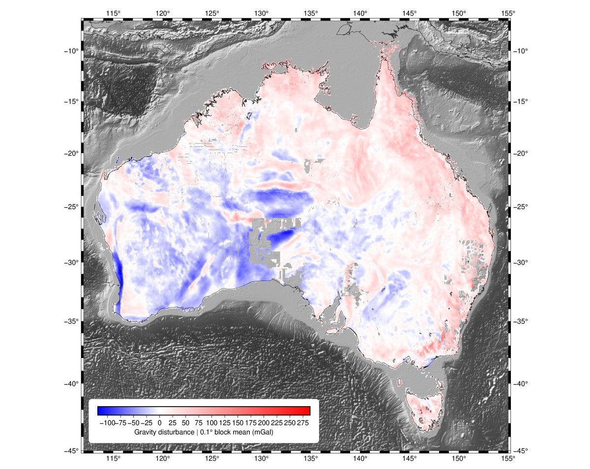
[Wynne (2018)](https://doi.org/10.26186/5C1987FA17078)
e
[Uieda (2021)](https://doi.org/10.6084/m9.figshare.13643837).

===============================================================================

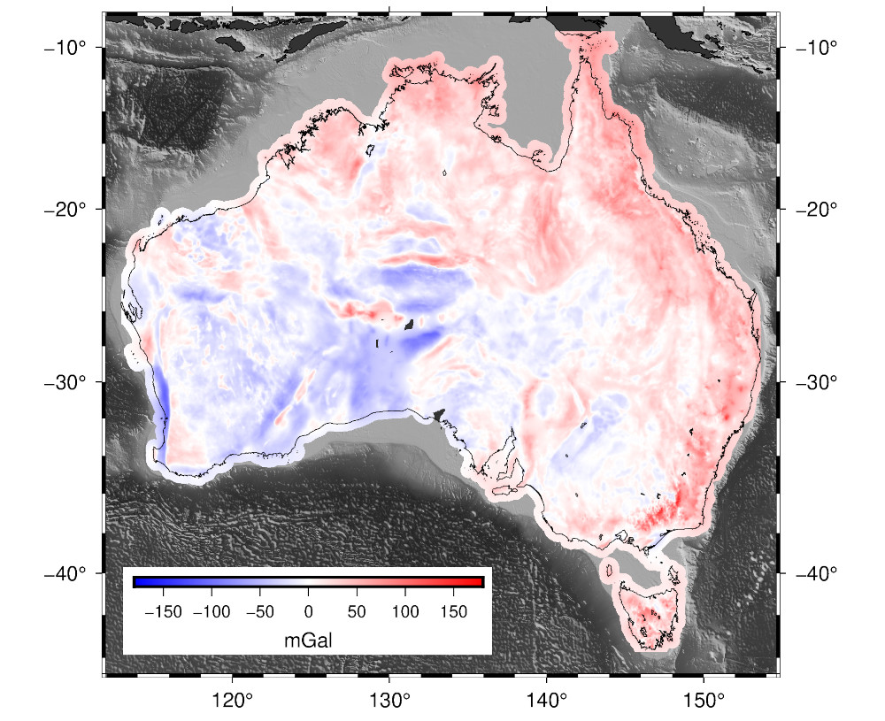
Soler & Uieda (2021; doi:[10.1093/gji/ggab297](https://doi.org/10.1093/gji/ggab297))

# Resultados com gradient-boosted EQS

Interpolação em malha de 1'
<!-- .element: class="fragment" -->

Continuação para altitude constante
<!-- .element: class="fragment" -->

~1.5h em computador com 16 Gb de RAM
<!-- .element: class="fragment" -->

===============================================================================

Zoom no noroeste da Austrália

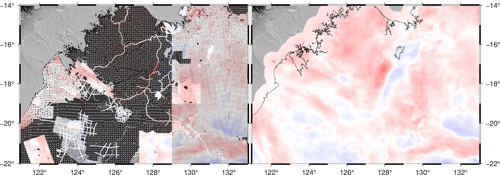
Soler & Uieda (2021; doi:[10.1093/gji/ggab297](https://doi.org/10.1093/gji/ggab297))

===============================================================================

# Adaptação para dados aeromagnéticos

===============================================================================

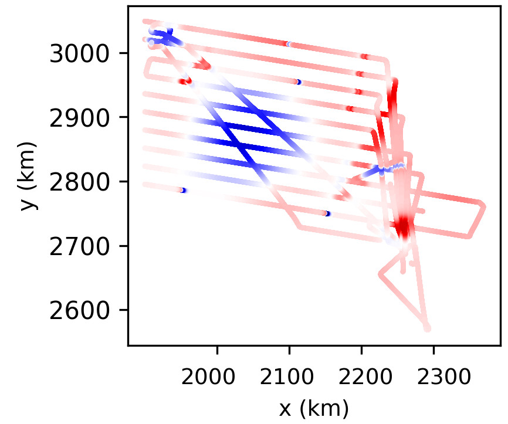
Uppal et al. (2025; doi:[10.1093/gji/ggaf359](https://doi.org/10.1093/gji/ggaf359))

===============================================================================

## Problemas com bordas e curtos comprimentos de onda

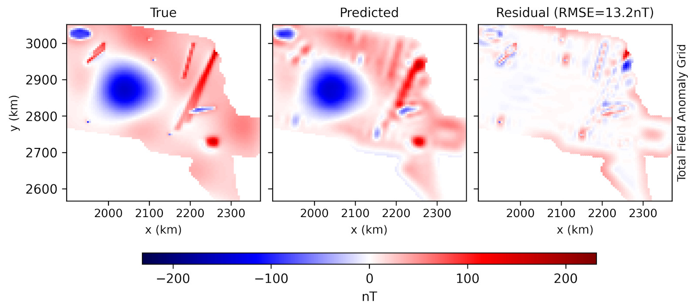
Uppal et al. (2025; doi:[10.1093/gji/ggaf359](https://doi.org/10.1093/gji/ggaf359))

===============================================================================

# Duas camadas

===============================================================================

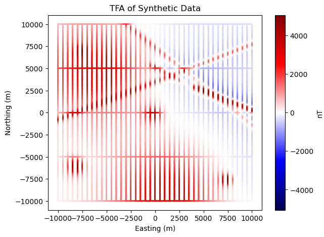
Fonte: India Uppal (não publicado)

===============================================================================

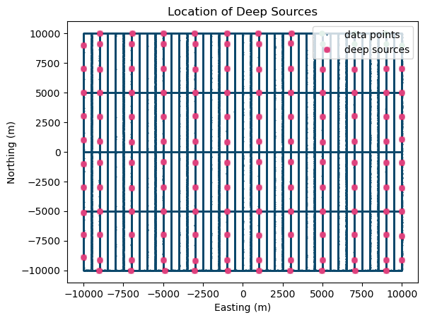
Fonte: India Uppal (não publicado)

===============================================================================

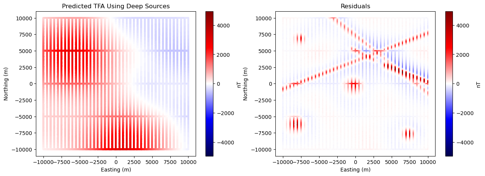
Fonte: India Uppal (não publicado)

===============================================================================

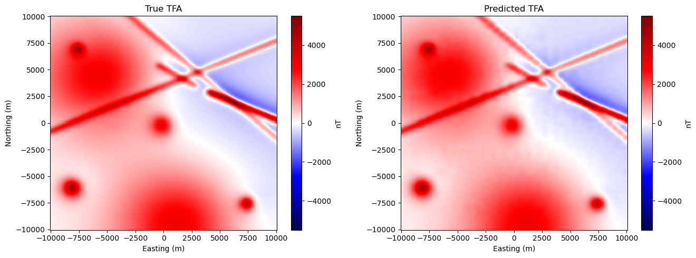
Fonte: India Uppal (não publicado)

===============================================================================

## Com uma camada

Uppal et al. (2025; doi:[10.1093/gji/ggaf359](https://doi.org/10.1093/gji/ggaf359))

===============================================================================

## Com duas camadas

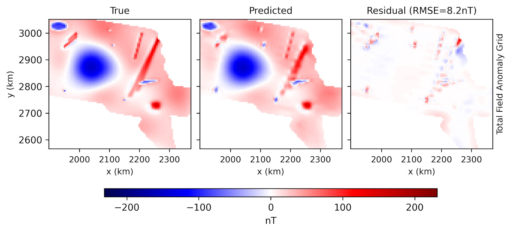
Uppal et al. (2025; doi:[10.1093/gji/ggaf359](https://doi.org/10.1093/gji/ggaf359))

===============================================================================

# Conclusões

Interpolar e transformar dados magnéticos
<!-- .element: class="fragment" -->

Controle de suavidade e estabilidade
<!-- .element: class="fragment" -->

Ponderar dados de maneira diferente na inversão
<!-- .element: class="fragment" -->

Fontes equivalentes para modelar milhões de dados
<!-- .element: class="fragment" -->

Preservar longos e curtos comprimentos de onda
<!-- .element: class="fragment" -->

===============================================================================

<!-- .slide: class="slide-transition" -->

# Parte 2   Microscopia magnética

===============================================================================

# Artigos

Souza-Junior, G. F., Uieda, L., Trindade, R. I. F., Carmo, J. and Fu, R. R.
(2024). **Full vector inversion of magnetic microscopy images using Euler
deconvolution as prior information.** Geochemistry, Geophysics, Geosystems.
doi:[10.1029/2023GC011082](https://doi.org/10.1029/2023GC011082).
<!-- .element: class="fragment" -->

Souza-Junior, G. F., Uieda, L., Trindade, R. I. F., Fu, R. R., Bellon, U. D.
and Castro, Y. M. (2025). **Robust directional analysis of magnetic microscopy
images using non-linear inversion and iterative Euler deconvolution.**
EarthArXiv. doi:[10.31223/X5N42F](https://doi.org/10.31223/X5N42F).
("major revisions" na JGR: Solid Earth)
<!-- .element: class="fragment" -->

===============================================================================

## Dados QDM de um espeleotema

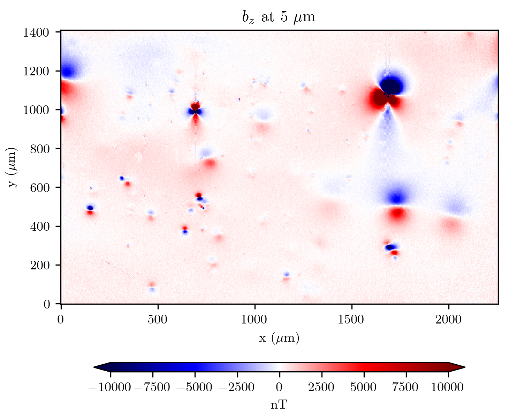

[Carmo et al. (2023)](https://doi.org/10.6084/m9.figshare.22965200.v1)
e
[Souza-Junior et al. (2024)](https://doi.org/10.1029/2023GC011082).

===============================================================================

## Gradiente total

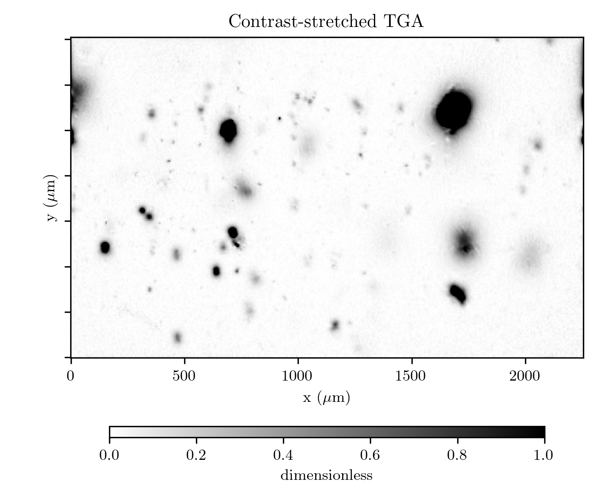

[Souza-Junior et al. (2024)](https://doi.org/10.1029/2023GC011082).

===============================================================================

## Detecção de anomalias com LoG

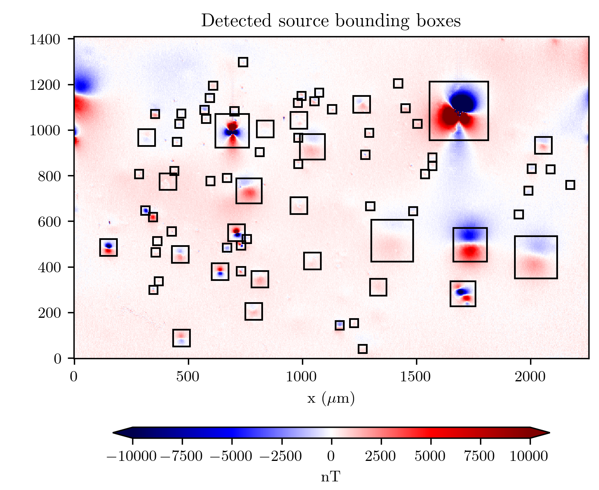

[Souza-Junior et al. (2024)](https://doi.org/10.1029/2023GC011082).

===============================================================================

## Deconvolução de Euler

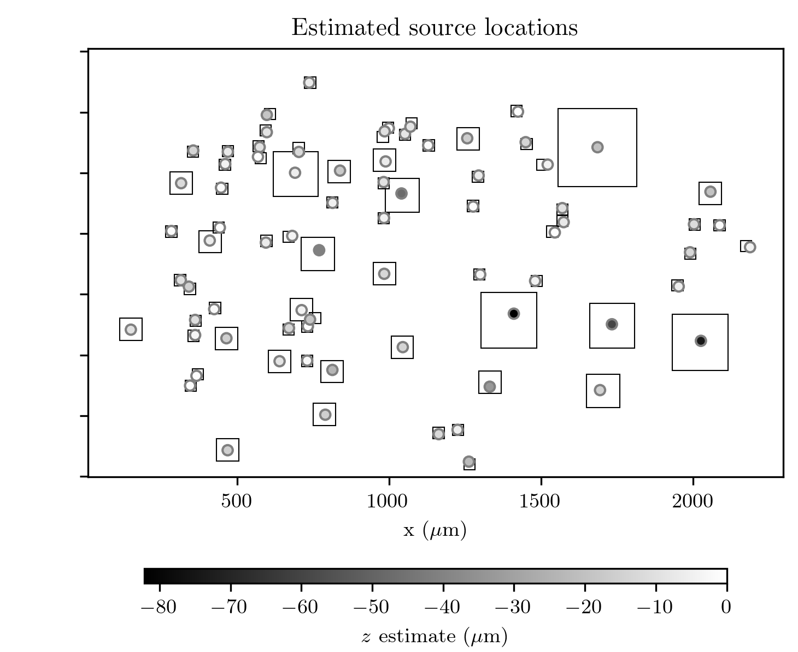

[Souza-Junior et al. (2024)](https://doi.org/10.1029/2023GC011082).

===============================================================================

## Inversão linear

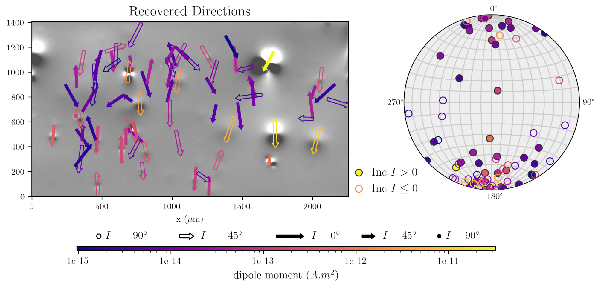

[Souza-Junior et al. (2024)](https://doi.org/10.1029/2023GC011082).

===============================================================================

## Problemas com fontes interferentes

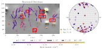

[Souza-Junior et al. (2024)](https://doi.org/10.1029/2023GC011082).

===============================================================================

# Algoritmo melhor

1. <!-- .element: class="fragment" -->
   Deconv. Euler e inversão linear da maior janela
1. <!-- .element: class="fragment" -->
   Refina posição e momento com inversão não-linear
1. <!-- .element: class="fragment" -->
   Remove o efeito da fonte estimada do dado todo
1. <!-- .element: class="fragment" -->
   Continua para todas as janelas

===============================================================================

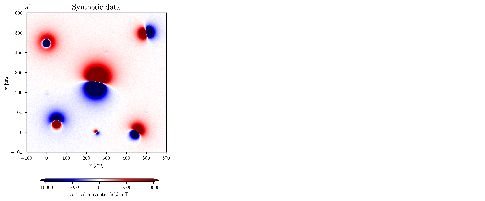

[Souza-Junior et al. (2025)](https://doi.org/10.31223/X5N42F).

===============================================================================

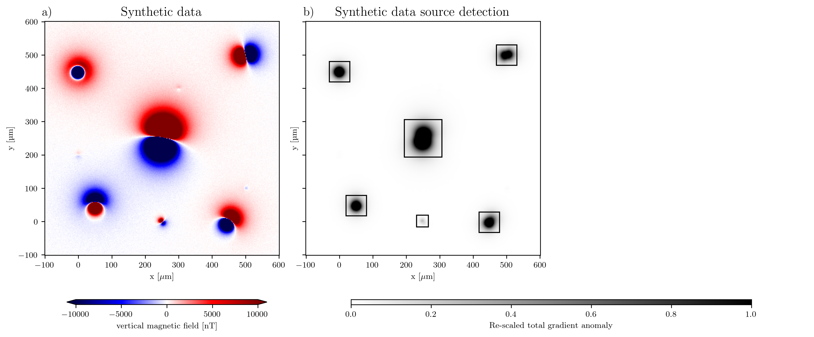

[Souza-Junior et al. (2025)](https://doi.org/10.31223/X5N42F).

===============================================================================

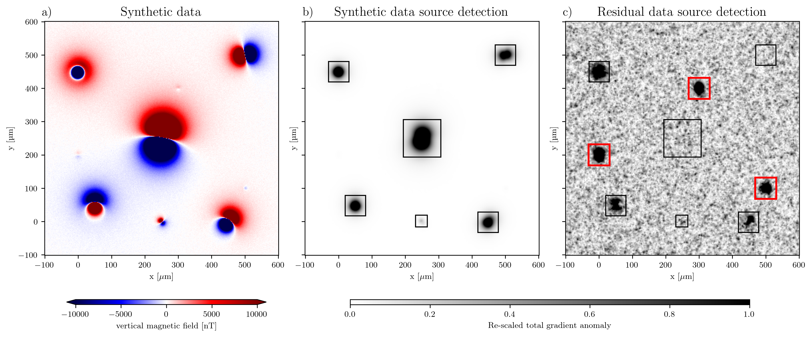

[Souza-Junior et al. (2025)](https://doi.org/10.31223/X5N42F).

===============================================================================

## Exemplo: Amostra de cerâmica

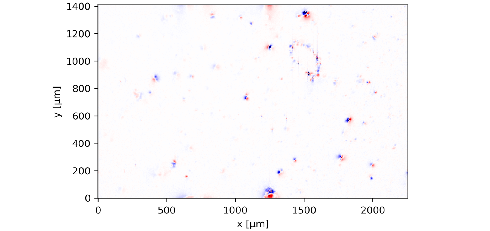

[Souza-Junior et al. (2025)](https://doi.org/10.31223/X5N42F).

===============================================================================

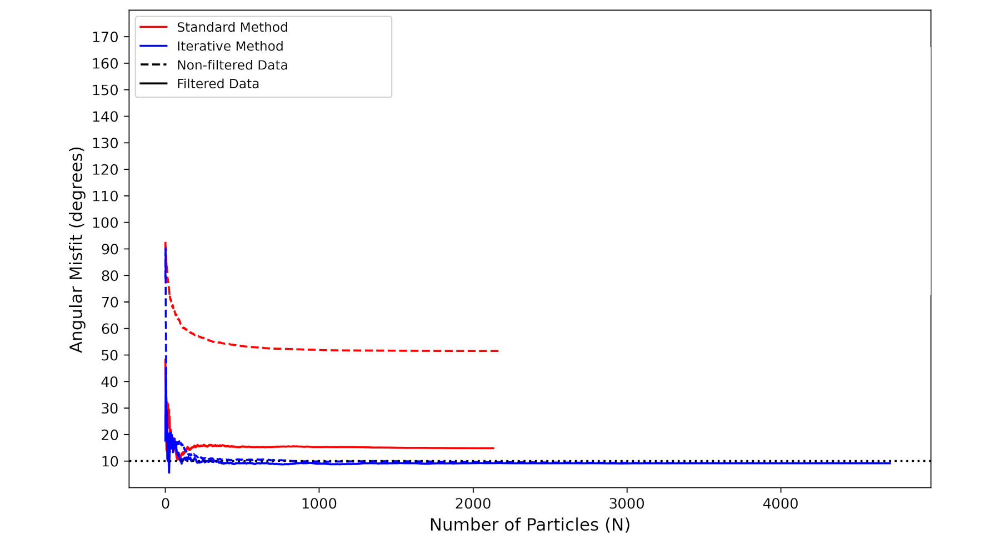

[Souza-Junior et al. (2025)](https://doi.org/10.31223/X5N42F).

===============================================================================

# Conclusões

Microscopia magnética pode revolucionar o paleomagnetismo
<!-- .element: class="fragment" -->

Precisa do sinal de milhares de fontes PSD ([Bellon et al., 2025](https://doi.org/10.1029/2025GL114771))
<!-- .element: class="fragment" -->

Métodos rápidos e automáticos para analisar os dados
<!-- .element: class="fragment" -->

Alternativas são análise manual ou baseadas em microCT ([de Groot et al., 2021](https://doi.org/10.1029/2021JB022364))
<!-- .element: class="fragment" -->

Nossos métodos podem democratizar o uso da microscopia magnética
<!-- .element: class="fragment" -->

===============================================================================

<!-- .slide: class="slide-transition" -->

# Parte 3   Inversão de Euler

===============================================================================

# Artigo

Uieda, L., Souza-Junior, G. F., Uppal, I. and Oliveira Jr., V. C. (2025).
**Euler inversion: Locating sources of potential-field data through inversion
of Euler's homogeneity equation.** Geophysical Journal International.
doi:[10.1093/gji/ggaf114](https://doi.org/10.1093/gji/ggaf114).

===============================================================================

# Deconvolução de Euler

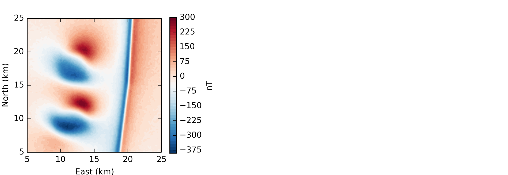

[Uieda et al. (2014)](https://doi.org/10.1190/tle33040448.1).

===============================================================================

# Deconvolução de Euler

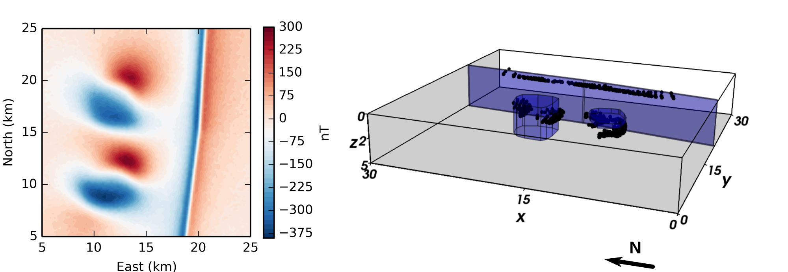

[Uieda et al. (2014)](https://doi.org/10.1190/tle33040448.1).

===============================================================================

# Problemas

1. <!-- .element: class="fragment" -->
   Muitas soluções espúrias
1. <!-- .element: class="fragment" -->
   Sensível a ruído de alta frequência
1. <!-- .element: class="fragment" -->
   Determinação do índice estrutural $\eta$
1. <!-- .element: class="fragment" -->
   $\eta$ está correlacionado com a profundidade

===============================================================================

# Equação da homogeneidade de Euler

$ (x - x_o)\partial_x f + (y - y_o)\partial_y f + (z - z_o)\partial_z f + \eta(f - b) = 0 $

$$
\begin{bmatrix}
  -\partial_x f_1 & -\partial_y f_1 & -\partial_z f_1 & -\eta \\\\
  -\partial_x f_2 & -\partial_y f_2 & -\partial_z f_2 & -\eta \\\\
  \vdots & \vdots & \vdots & \vdots \\\\
  -\partial_x f_N & -\partial_y f_N & -\partial_z f_N & -\eta
\end{bmatrix}
\begin{bmatrix}
  x_o \\\\ y_o \\\\ z_o \\\\ b
\end{bmatrix}
=
\begin{bmatrix}
  -x_1\partial_x f_1 - y_1\partial_y f_1 - z_1\partial_z f_1 - \eta f_1 \\\\
  -x_2\partial_x f_2 - y_2\partial_y f_2 - z_2\partial_z f_2 - \eta f_2 \\\\
  \vdots \\\\
  -x_N\partial_x f_N - y_N\partial_y f_N - z_N\partial_z f_N - \eta f_N \\\\
\end{bmatrix}
$$ <!-- .element: class="fragment" -->

Derivadas aparecem na Jacobiana
<!-- .element: class="fragment" -->

===============================================================================

# Inversão de Euler

===============================================================================

Vetor de dados

$$
\mathbf{d} =
\begin{bmatrix}
\mathbf{f} \\\\
\mathbf{\nabla}_x\mathbf{f} \\\\
\mathbf{\nabla}_y\mathbf{f} \\\\
\mathbf{\nabla}_z\mathbf{f}
\end{bmatrix}
$$

Equação de Euler

$$
\mathbf{e}(\mathbf{p}, \mathbf{d}) = \mathbf{0}
$$

Problema inverso vinculado

$$
\begin{aligned}
\min_{\mathbf{p}, \mathbf{d}} \quad &
  \phi(\mathbf{d}) =
  \left[\mathbf{d}^o - \mathbf{d}\right]^T \mathbf{W}
  \left[\mathbf{d}^o - \mathbf{d}\right]
\\\\
\textrm{subject to} \quad &
  \mathbf{e}(\mathbf{p}, \mathbf{d}) = \mathbf{0}
\end{aligned}
$$

Estima **dados $\mathbf{d}$ e parâmetros $\mathbf{p}$**
<!-- .element: class="fragment" -->

Inspirado no "ajuste combinado"  da geodésia
<!-- .element: class="fragment" -->

===============================================================================

## Sintéticos

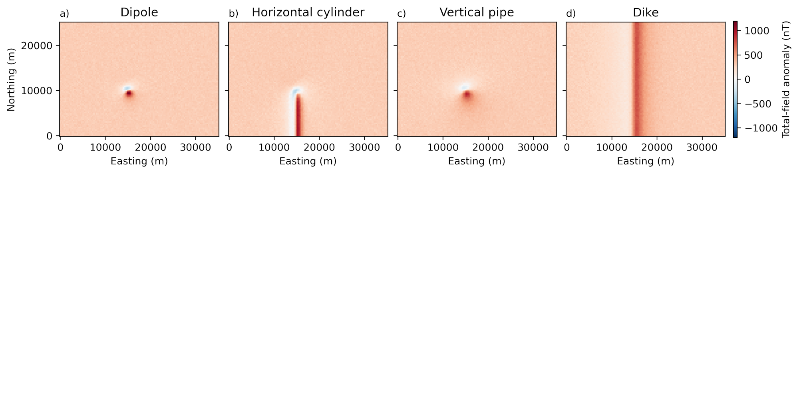

[Uieda et al. (2025)](https://doi.org/10.1093/gji/ggaf114).

===============================================================================

## Sintéticos

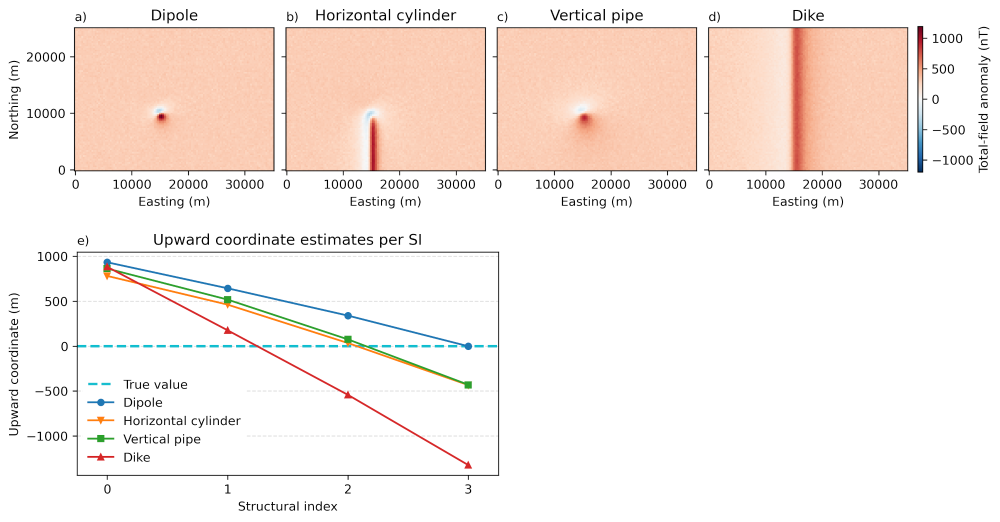

[Uieda et al. (2025)](https://doi.org/10.1093/gji/ggaf114).

===============================================================================

## Sintéticos

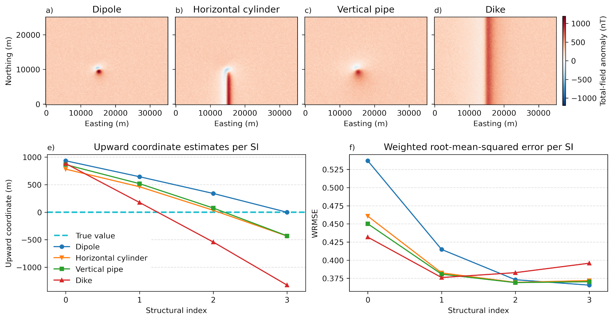

[Uieda et al. (2025)](https://doi.org/10.1093/gji/ggaf114).

===============================================================================

## Sintéticos

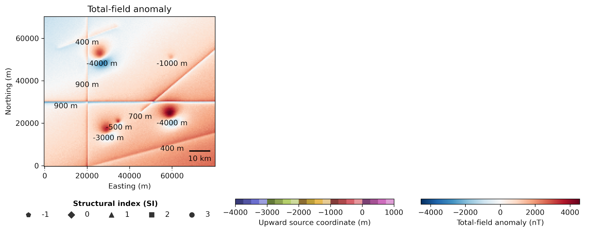

[Uieda et al. (2025)](https://doi.org/10.1093/gji/ggaf114).

===============================================================================

## Sintéticos

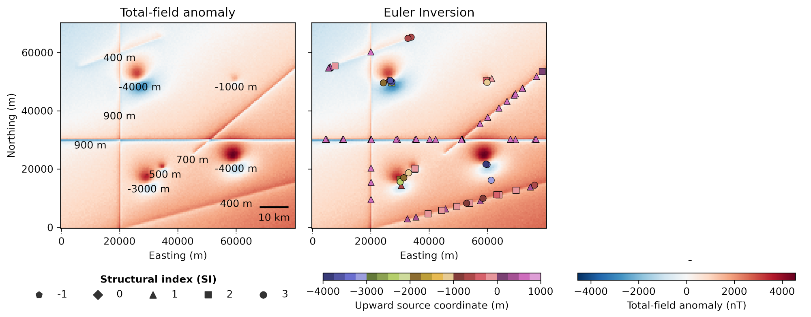

[Uieda et al. (2025)](https://doi.org/10.1093/gji/ggaf114).

===============================================================================

## Sintéticos

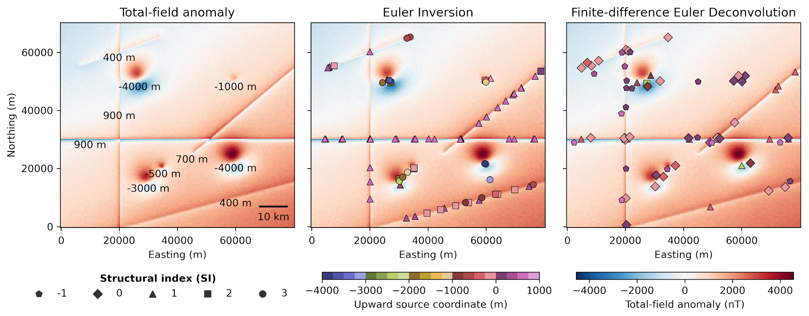

[Uieda et al. (2025)](https://doi.org/10.1093/gji/ggaf114).

===============================================================================

## Dados aeromagnéticos do Rio de Janeiro

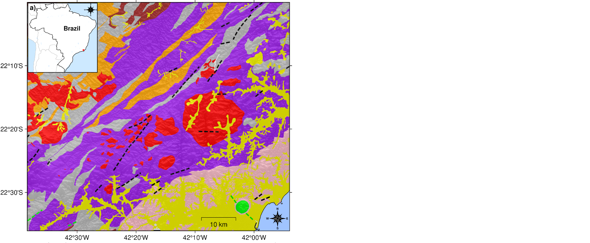

[Uieda et al. (2025)](https://doi.org/10.1093/gji/ggaf114).

===============================================================================

## Dados aeromagnéticos do Rio de Janeiro

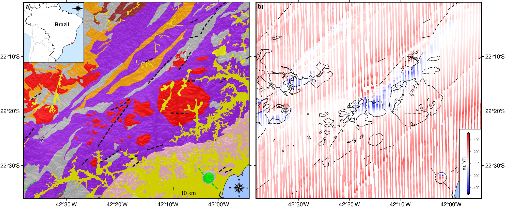

[Uieda et al. (2025)](https://doi.org/10.1093/gji/ggaf114).

===============================================================================

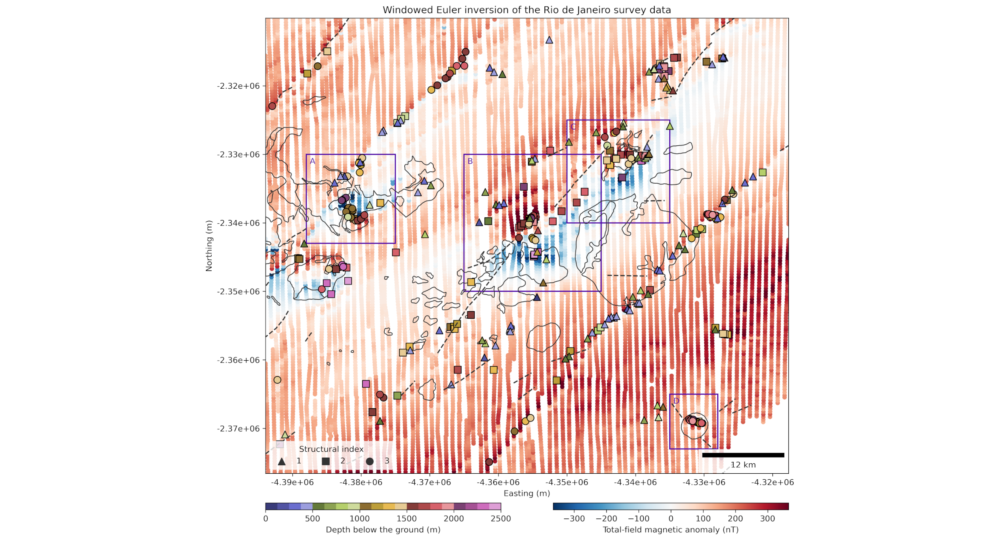

[Uieda et al. (2025)](https://doi.org/10.1093/gji/ggaf114).

===============================================================================

[Uieda et al. (2025)](https://doi.org/10.1093/gji/ggaf114).

===============================================================================

[Uieda et al. (2025)](https://doi.org/10.1093/gji/ggaf114).

===============================================================================

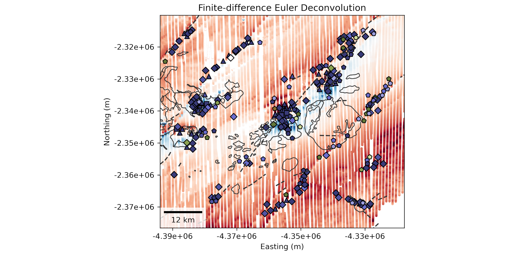

[Uieda et al. (2025)](https://doi.org/10.1093/gji/ggaf114).

===============================================================================

# Conclusões

Nova formulação matemática
<!-- .element: class="fragment" -->

Estima o dado predito junto com os parâmetros
<!-- .element: class="fragment" -->

Mais robusta a ruído e fontes interferentes
<!-- .element: class="fragment" -->

Capaz de estimar o índice estrutural
<!-- .element: class="fragment" -->

Fazer mais comparações com outros métodos
<!-- .element: class="fragment" -->

===============================================================================

<!-- .slide: class="slide-transition" -->

# Conclusões gerais

===============================================================================

Modelagem do campo magnético terrestre
<!-- .element: class="fragment" -->

Fontes equivalentes em larga escala
<!-- .element: class="fragment" -->

Inversão automática e rápida de microscopia
<!-- .element: class="fragment" -->

Inversão robusta de posição e índice estrutural
<!-- .element: class="fragment" -->

===============================================================================

# Objetivos futuros

Junção de dados aeromagnéticos e de satélite em escala continental
<!-- .element: class="fragment" -->

Ponderar diferentes levantamentos com qualidades díspares
<!-- .element: class="fragment" -->

Aplicar fontes equivalentes a dezenas ou centenas de milhões de dados
<!-- .element: class="fragment" -->

Realizar estudos paleomagnéticos com microscopia
<!-- .element: class="fragment" -->

Criar uma biblioteca em Python para microscopia:
[Magali](https://www.fatiando.org/magali)

<!-- .element: class="fragment" -->

Comparar inversão de Euler com outros métodos
<!-- .element: class="fragment" -->

Inversão de Euler em coordenadas esféricas
<!-- .element: class="fragment" -->

===============================================================================

<!-- .slide: class="slide-transition" -->

===============================================================================

<!-- .slide: data-background-image="assets/compgeolab.jpg" data-background-size="contain" data-background-position="bottom" -->

# Obrigado aos estudantes   e colaboradores do CompGeoLab

India, Gelson, Santiago, Arthur, Yago, Eros, Ellen, Gabriel, Felipe, Paulo,
Gabriella, Jefferson

Vanderlei Oliveira Jr., Ricardo Trindade, Richard Holme, Roger Fu,
 Ualisson Bellon, Janine Carmo

===============================================================================

<!-- .slide: class="slide-contact" data-background-image="assets/contact-slide.svg" data-background-size="contain" data-background-color="#000000" -->

<i class="fas fa-comments"></i>
 
Contato e mais informações:
 
<a href="https://www.leouieda.com">www.leouieda.com</a>
 
<a href="https://www.compgeolab.org">www.compgeolab.org</a>

<i class="fab fa-github"></i>
 
Código desta apresentação e o texto da tese:
 
[github.com/leouieda/livre-docencia](https://github.com/leouieda/livre-docencia)

<i class="fab fa-creative-commons"></i><i class="fab fa-creative-commons-by"></i>
 
[Creative Commons Attribution 4.0 International License](https://creativecommons.org/licenses/by/4.0/).

Imagem de fundo é uma cena do Landsat 9 próximo à foz do Rio Amazonas.
Fonte: [github.com/leouieda/landsat-wallpapers](https://github.com/leouieda/landsat-wallpapers)

